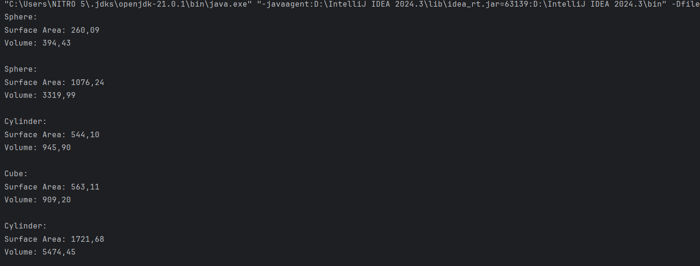
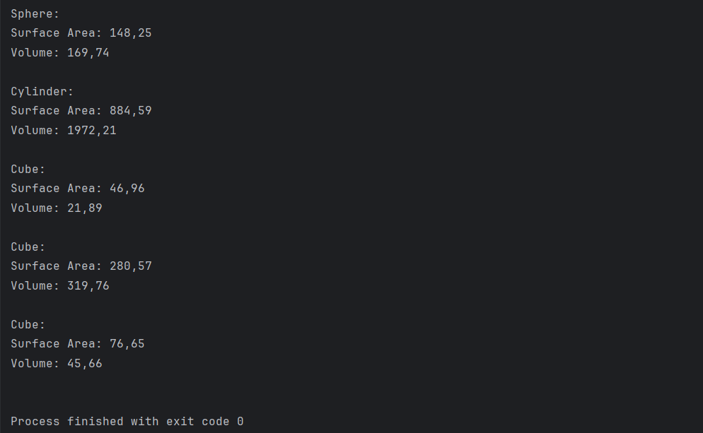

# 3D Shapes Project
## Project Description
This project demonstrates polymorphism in Java through the implementation of an interface for 3D shapes. 
The project includes three specific shapes: Sphere, Cylinder, and Cube. 
Each shape implements the Shape3DInterface, which defines methods for calculating the surface area and volume of the shape.

The program generates random instances of these shapes with dimensions (e.g., radius, height, side length) within a specified range, computes their properties, and displays the results. This project is a great example of object-oriented programming concepts, specifically abstraction, encapsulation, and polymorphism.

## How Polymorphism is Used
Polymorphism is a key concept demonstrated in this project:

1. Interface Implementation:

- The Shape3DInterface defines the methods surfaceArea() and volume().
- Each shape class (Sphere, Cylinder, and Cube) implements the interface and provides its specific implementation of these methods.
  
2. Dynamic Method Invocation:

- All objects are treated as Shape3DInterface references, allowing the program to call the surfaceArea() and volume() methods without knowing the specific type of the object at compile time.
- This makes it possible to store objects of different shapes in a single collection and process them uniformly.
  
3. Code Reusability and Flexibility:

- New 3D shapes can be added easily by implementing the Shape3DInterface without modifying the existing code.
  
## How to Run
### Prerequisites:

- Java Development Kit (JDK) installed (version 8 or later).
- IntelliJ IDEA or any IDE supporting Java projects.
- Alternatively, a terminal with javac and java commands configured.

Sample Outputs:

## Explanation of Output:
- Each shape’s properties are calculated based on randomly generated dimensions.
- The output varies with every execution as dimensions are generated within a random range.
  
